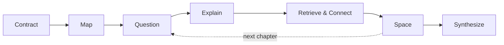

# BookMind

**Study books with Claude, don't just summarize them.**

BookMind is a plugin for [Claude Code](https://code.claude.com/docs/en/quickstart) with skills for reading, understanding, and working with books. You bring the book. BookMind brings a study method grounded in learning research. Claude handles the mapping, quizzing, checking, and scheduling.

**What you need:** Claude Code, signed in with a Claude Pro, Max, Team, or Enterprise plan, a Claude Console account, or a [supported cloud provider](https://code.claude.com/docs/en/third-party-integrations). BookMind itself is free; studying with it uses your normal Claude usage, and a whole book uses a lot more than a single chapter. It runs wherever Claude Code does (terminal, desktop app, or VS Code), because it reads your book files and saves your study notes on your computer.

## Contents

- [Install](#install)
- [Your first session](#your-first-session)
- [Skills](#skills)
- [Understanding Books](#understanding-books)
  - [Overview](#overview)
    - [When it kicks in](#when-it-kicks-in)
    - [How it works](#how-it-works)
  - [Getting started](#getting-started)
    - [What to give it](#what-to-give-it)
    - [Bringing your book](#bringing-your-book)
    - [Example prompts](#example-prompts)
    - [Getting help](#getting-help)
  - [Studying](#studying)
    - [Pick how you want to study](#pick-how-you-want-to-study)
    - [Pick your depth](#pick-your-depth)
    - [How a chapter session goes](#how-a-chapter-session-goes)
  - [Reviews and notes](#reviews-and-notes)
    - [Your study folder and reviews](#your-study-folder-and-reviews)
  - [Trust and quality](#trust-and-quality)
    - [What it's built to do](#what-its-built-to-do)
    - [The research behind it](#the-research-behind-it)
  - [Tips](#tips)
- [For contributors](#for-contributors)
  - [Project layout](#project-layout)
  - [Try it locally](#try-it-locally)
  - [Run the evals](#run-the-evals)
  - [Adding a skill](#adding-a-skill)
- [License](#license)

## Install

In Claude Code, type these two commands one at a time. They go in Claude Code's prompt, not your regular terminal:

```
/plugin marketplace add v8tix/bookmind
/plugin install bookmind@bookmind
```

`bookmind@bookmind` means "the `bookmind` plugin from the `bookmind` marketplace". When asked for a scope, pick **User** to use it in every folder.

Using the desktop app or VS Code, and `/plugin` isn't available? Install from their plugin manager instead; see [Discover plugins](https://code.claude.com/docs/en/discover-plugins).

**Staying up to date:** new versions don't install on their own. The easiest fix is to run `/plugin`, open **Marketplaces**, pick **bookmind**, and choose **Enable auto-update**. To update by hand instead, run this in your regular terminal, then `/reload-plugins` in Claude Code:

```
claude plugin update bookmind@bookmind
```

## Your first session

1. Put your book, as a PDF or a Markdown file, somewhere on your computer, say `~/books/my-book.pdf`, and pick a folder for your notes, say `~/study-notes`. See [Bringing your book](#bringing-your-book).
2. Open a terminal and run `claude`, or open the Claude desktop app.
3. Tell Claude what you're after, and give it both paths: "Help me understand chapter 1 of `~/books/my-book.pdf`. I want to remember it for a few months. Save my notes in `~/study-notes`."
4. Claude asks a question or two if it needs to, then gets you started on the chapter.

Not sure what to type? Run `/bookmind:understanding-books help` to see every input, option, and example (see [Getting help](#getting-help)).

Claude needs both paths, and it won't guess either one. If you leave one out, its first reply asks for it and says why: the book so it works from the real text and cites its pages, and the notes folder so your questions and review dates are saved where you choose and your next session can find them.

Claude Code usually asks before it runs a command or saves a file. Say yes when it wants to read your book or write your study notes.

## Skills

| Skill | What it does for you | Try saying |
|---|---|---|
| [Understanding Books](#understanding-books) | Maps a nonfiction or technical book, quizzes you before and after you read, checks your answers against the text, and schedules spaced reviews in a study folder | "Help me really understand chapter 3 of this book" |

More skills are on the way. You don't need to call a skill by name: Claude picks the right one from what you ask. If you'd rather be explicit, type `/bookmind:<skill-name>`.

---

## Understanding Books

`/bookmind:understanding-books`

Ever finished a chapter and realized a week later you couldn't explain a thing it said? This skill is for that. It helps you rebuild the author's argument in your own head, keeps what the book actually says separate from everyone's opinions (Claude's included), and brings the key ideas back over the following days and weeks, with longer gaps each time you get them right.

It's built for **nonfiction and technical books**: textbooks, engineering books, history, philosophy, business, and popular science.

### Overview

#### When it kicks in

Just talk to Claude normally. The skill joins in when you want to study, understand, analyze, summarize, or remember a book or chapter, when you're working through a textbook's exercises, or when you come back for a review. For example:

- "Help me deeply understand chapter 3 of this distributed systems book. I have an interview on October 23."
- "Analyze this book for me: thesis, main arguments, evidence, weaknesses."
- "Give me a 5-minute overview of this book."
- "I'm stuck on exercise 2.14 in my linear algebra textbook."
- "Time for my review of chapter 3."

If a request leaves out the book or the notes folder, Claude asks for it first; see [Example prompts](#example-prompts) for complete requests.

It stays out of the way for novels, poetry, and plays, for book recommendations, and for writing or editing your own book.

#### How it works

The skill follows a method called the **Book Understanding Protocol**: seven phases, from agreeing on your goal to pulling the whole book together into one argument.



| Phase | What happens |
|---|---|
| **Contract** | Claude gets the book and notes paths, then settles your goal, depth, deadline, and mode, asking at most two questions beyond the paths |
| **Map** | Claude sketches the whole book: its problem, audience, parts, and a first guess at its main argument |
| **Question** | Before each chapter, you guess at 3–5 questions about its big ideas |
| **Explain** | After reading (or Claude's chapter brief), you explain how each key idea works, why it holds, and where it stops holding |
| **Retrieve & Connect** | With the book closed, you answer the questions and sketch how the ideas connect; Claude checks against the text and re-asks what you missed |
| **Space** | Claude writes review questions with calendar dates, spaced further apart each time you get them right |
| **Synthesize** | After the last chapter, the book comes together as one argument: thesis, supporting claims, weak spots, and what you'll use |

Question through Space repeat for every chapter. Who does the work depends on the mode:

| Phase | Guided (you read) | Hybrid (you won't read) | Analyst (just the analysis) |
|---|---|---|---|
| Map | Claude, without spoiling chapter conclusions | Claude | Claude |
| Question | You guess, then read | You guess, then get Claude's chapter brief | Skipped |
| Explain | You explain; Claude diagnoses | You explain the brief; Claude diagnoses | Claude explains |
| Retrieve & Connect | You recall and map; Claude checks | You recall and map; Claude checks | Claude maps from the text |
| Space | You review on schedule | You review on schedule | Skipped |
| Synthesize | You draft; Claude checks | You draft; Claude checks | Claude writes it |

Depth sets how much of each phase runs (see [Pick your depth](#pick-your-depth)). The details are in [Pick how you want to study](#pick-how-you-want-to-study), [How a chapter session goes](#how-a-chapter-session-goes), and [Your study folder and reviews](#your-study-folder-and-reviews), and the research behind each phase is in [The research behind it](#the-research-behind-it).

### Getting started

#### What to give it

There are no flags to memorize: say these in plain words, in any order. Only the first two are required.

| Input | Required | What to give | If you leave it out |
|---|---|---|---|
| **Book** (input) | Yes | A path to the book (PDF or Markdown) or its folder (see [Bringing your book](#bringing-your-book)). Or say "no file" | Claude asks for it and doesn't start |
| **Notes folder** (output) | Yes | A folder for your study notes. Claude creates `<notes folder>/<book-name>/` inside it. Or say "no files" | Claude asks for it and doesn't start |
| **Scope** | No | A chapter, a range of chapters, or the whole book | Claude works from your request, usually one chapter at a time |
| **Mode** | No | **Guided** (you read), **hybrid** (you won't read), or **analyst** (just the analysis) | Picked from your request |
| **Depth** | No | **Light**, **standard**, or **deep** | Light or standard, unless you're aiming for mastery |
| **Goal** | No | Exam, interview, building something, critique, or plain curiosity | Inferred; it shapes the review questions |
| **Deadline** | No | An exam or interview date, or how long you want to remember it | Reviews planned for three months |
| **Language** | No | The language for your notes | The language you write in |

Claude asks at most two questions beyond the paths, and states what it assumed for the rest.

#### Bringing your book

- **Give the path.** Tell Claude where the book is, for example `~/books/my-book.pdf`, or a folder that holds it. Claude never searches your computer for it. Before reading, it checks what kind of file it is.
- **PDF**: Claude reads it chapter by chapter and cites printed page numbers, or "PDF p." when it can't tell the printed number.
- **Markdown**, including books converted from a PDF: if the conversion left page markers, Claude works out how they map to the printed page numbers and cites the printed pages. Without markers, citations point to the chapter and section instead. Page images and metadata files the converter saves next to the `.md` can stay in the folder.
- **Other formats** haven't been tested yet. Convert your book to PDF or Markdown first.
- **No file?** Say so when Claude asks for the path. For well-known books, Claude can work from what it already knows. It labels that as *recalled, not verified against the text*, points to chapters at most, gives no quotes or page numbers, and offers to check against an excerpt you paste. For anything less well known, it asks for the text rather than guess.

#### Example prompts

Replace the paths with your own.

| You want to | Say |
|---|---|
| Study a chapter for an interview | "Help me understand chapter 3 of `~/books/ddia.pdf`. I have an interview on October 23. Save my notes in `~/study-notes`." |
| Remember a book you won't read | "Help me study `~/books/team-topologies.md` and go deep. I won't read it. Save my notes in `~/study-notes`." |
| Get an analysis, no quizzing | "Analyze `~/books/deep-work.pdf`: thesis, main arguments, evidence, and weak spots. Save it in `~/study-notes`." |
| Get a quick overview | "Give me a 5-minute overview of `~/books/atomic-habits.md`. Don't save any files." |
| Work through an exercise | "I'm stuck on exercise 2.14 in `~/books/linear-algebra.pdf`. My notes are in `~/study-notes`." |
| Study a book in another language | "Ayúdame a estudiar el capítulo 1 de `~/libros/sapiens.md`, notas en inglés, en `~/study-notes`." |
| Do your scheduled review | "Time for my review. My notes are in `~/study-notes`." |
| Get flashcards | "Export my review questions for this book to Anki." |
| Work from memory, no file | "Help me understand chapter 2 of *Thinking, Fast and Slow*. I don't have the file. Save my notes in `~/study-notes`." |

#### Getting help

Type `/bookmind:understanding-books help` (or `--help` / `-h`) to print a CLI-style help: usage, the required inputs, the optional ones with their defaults, the phrases you can use during a session, example prompts, and the files in the study folder. Claude shows the help and stops; it doesn't ask for paths or open any book. A request that names a book, like "help me study chapter 3", starts a session instead.

```text
BookMind · understanding-books
Study nonfiction and technical books: map, quiz, explain, recall, and
spaced review, with notes saved to a study folder.

USAGE
  /bookmind:understanding-books <request that names INPUT and OUTPUT>
  /bookmind:understanding-books help

REQUIRED
  INPUT         The book as a PDF or Markdown file, or the folder that holds
                it. Or say "no file" to work from pasted excerpts ...
  OUTPUT        Notes folder. Claude creates <OUTPUT>/<book-name>/ in it.
                Or say "no files" to get a paste-back review kit instead.
...
```

### Studying

#### Pick how you want to study

Claude picks a mode from what you ask, and you can switch any time.

| Mode | Best when | What happens |
|---|---|---|
| **Guided** | You're reading the book yourself and want to remember it | You guess, explain, and recall first; Claude gives feedback after each attempt |
| **Hybrid** | You want to remember the ideas but won't read the book | You guess at a few questions, then a chapter brief from Claude (its claims, mechanisms, and evidence, with page references) stands in for the reading. You explain and recall, and Claude gives its full analysis after your attempt |
| **Analyst** | You just want the analysis | Claude does the work: map, summary, argument, evidence, and weak spots |

You're always in charge:

- Say **"just give me the answer"** and you'll get it right away, with no hints first.
- Say **"stop quizzing me"** and Claude answers the rest of that step's questions itself. It only covers the step you're on, so the next step, the next chapter, and your scheduled reviews still ask you first. Anything Claude answered for you comes back in your review the next day.
- Ask a plain question, like "what does quorum mean here?", and you'll get a straight answer.

Claude only holds back answers to questions it asked you and, in guided mode, to the book's own exercises and the conclusions of sections you haven't read yet. Stuck on an exercise? Claude asks what you tried and starts with a small hint, and the full solution is yours whenever you ask.

#### Pick your depth

| Depth | Extra time on top of reading | What you do (guided and hybrid) |
|---|---|---|
| Light | About 25% | A map of the book, plus, per chapter: 2–3 questions to guess at before reading, one from-memory sketch of how the ideas connect, and 3–5 review questions |
| Standard | About 50–75% | Light with 3–5 questions per chapter, plus explaining each key idea in your own words, and a look at what the chapter's main claim assumes and where it stops holding |
| Deep | About 100% or more | Standard, plus that closer look for every key idea, rating how sure you are before each answer, one-page concept cards for the book's 5–10 core ideas, and a full write-up of the book's whole argument |

Claude picks the depth from your goal and the time you have, and leans to Light or Standard unless you're aiming for mastery.

In analyst mode, depth sets how much Claude writes instead: Light covers the book map, each chapter's main claim and how its ideas connect, and a short wrap-up; Standard adds an explanation of each key idea and where the main claim stops holding; Deep adds concept cards and the full write-up. You won't get quizzes or reviews unless you want to remember the book.

A quick overview gets you a short answer: the thesis, a few key ideas, one caveat, and a next step.

#### How a chapter session goes

Here's a typical chapter in guided mode at Standard depth:

1. **Map.** Claude shows where the chapter fits in the book, without spoiling its conclusions.
2. **Questions.** You get 3–5 questions about the chapter's big ideas and take a quick guess at each. Wrong guesses are fine; they help you spot the answers while you read.
3. **Read.** You read the chapter, looking for those answers.
4. **Explain.** For each key idea, you explain how it works, why it holds, and give an example. Then you say what the chapter's main claim assumes and where it stops holding. Claude points out exactly what's missing, with a hint first and the full answer whenever you ask.
5. **Recall.** With the book closed, you answer the questions and sketch how the ideas connect ("A causes B", "C depends on D"). Claude checks your answers against the text. A bit later in the session, it asks again about anything you didn't fully get, until you've recalled it correctly once.
6. **Schedule.** Claude writes 3–5 review questions shaped like your real task (exam-style questions, interview scenarios, objections to answer, or exercises), starting with what you missed, and saves them with their review dates.

Once you've finished the book, you pull it all together into one argument: the thesis, the claims holding it up, its weak spots, and what you'll actually use.

### Reviews and notes

#### Your study folder and reviews

Each new conversation with Claude starts fresh, so your reviews need somewhere to live. Claude keeps a small study folder for each book inside the notes folder you gave it, named after your book's file or folder:

```
<your notes folder>/<book-name>/
├── book.md        # your map of the book, what you've read, key concepts, and final write-up
├── chapters/      # one file per chapter
├── review.md      # review questions, due dates, and your results
├── overview.md    # quick overviews and analyses, when you ask for them
├── notes/         # Claude's working notes while it reads a long book
└── source/        # a text copy Claude extracted from your book, if it needed one
```

Everything Claude writes for a book stays in this folder, including Anki exports and extracted copies. Nothing goes next to your book, into a temporary folder, or anywhere else.

- **Real dates that fit your goal.** Every review gets a calendar date. With an exam or interview, you get 2–4 reviews before it (daily if it's less than a week away), the last one 1–3 days before. Otherwise, the first review is the day after the chapter and the gap grows each time you get it right: roughly 1, 3, 7, 21, and 45 days, then 3 and 6 months. With no end date, Claude plans for three months and tells you.
- **You're the reminder.** Claude doesn't send notifications, so copy the review dates into your own calendar.
- **Easy to pick up.** Next time, say "time for my review" and give Claude your notes folder (and the book, if you have it). Claude finds the study folder there, asks the questions that are due (oldest first, and on the same day, the ones you missed last time), checks your answers, re-asks any misses, and sets the next dates.
- **No peeking.** Answers live in their own section and are never shown before you try.
- **Honest about history.** Reviewing early runs as practice and leaves your schedule alone. If there's no record of an earlier session, Claude says so and builds fresh questions instead of making up past results.
- **Flashcards if you like.** Ask for a `review.csv` you can import into Anki.
- **Rather not keep any files?** Say so instead of giving a notes folder. At the end of each session, Claude gives you a review kit to paste back next time.

### Trust and quality

#### What it's built to do

- **Clear sourcing.** Claims are labeled as the **author's**, outside **context**, **your** interpretation, or an **inference**.
- **No invented quotes or pages.** Claude is told to cite only what it actually read and to tell you which parts it hasn't read. It can still slip, so check any quote or page number against your copy before it goes into an essay or slides.
- **Your book can't give Claude orders.** Claude reads your book as material to study, not as instructions. If a file contains text aimed at AI tools (asking it to add a link, change its answer, or keep something from you), Claude tells you about it instead of following it.
- **Short quotes only.** It paraphrases and points you to the page instead of copying long passages.
- **Shaky claims flagged.** If a book leans on research Claude knows is contested or failed to replicate (like "ego depletion", the idea that willpower runs out like a battery), on ideas that have been superseded, or on an old software version, it tells you before you memorize them. For health, money, legal, or medical advice, it sticks to small, low-risk experiments and points you to a professional.
- **Your language.** Claude replies in the language you write in. If the book is in another language, key terms show up in both, and short quotes stay in the original with Claude's translation.

#### The research behind it

Each step borrows a well-studied learning technique: guessing at questions before you read, recall practice with feedback, explaining ideas in your own words, building concept maps from memory, and spaced review. Nobody has tested this exact combination on whole books, and most studies used short texts, so think of it as well grounded rather than proven. The research, with honest notes on its limits, is in [evidence.md](skills/understanding-books/references/evidence.md).

### Tips

- **Say what you're studying for, and by when.** "Interview on October 23" gets you a very different plan than "just curious".
- **Answer from memory, even when it feels hard.** That effort is part of what makes it stick.
- **Keep reviews short and regular.** A few minutes of recall on the right day beats rereading the whole chapter.

---

## For contributors

### Project layout

```
.claude-plugin/
├── plugin.json          # plugin manifest
└── marketplace.json     # makes this repo its own marketplace
skills/<skill-name>/     # one folder per skill: SKILL.md plus references/
evals/<skill-name>/      # test cases for each skill
scripts/check_skills.py  # lints every skill before you open a pull request
```

### Try it locally

```
claude --plugin-dir .
```

Run `/reload-plugins` after you edit a skill. Before you open a pull request, run both validators:

```
./scripts/check_skills.py   # skills: frontmatter, naming, description, SKILL.md length, relative links
claude plugin validate .    # plugin and marketplace manifests
```

`check_skills.py` runs with [uv](https://docs.astral.sh/uv/), which fetches its one dependency (PyYAML) on the fly. Without uv, install PyYAML and run `python3 scripts/check_skills.py`. Errors fail the check and warnings don't, unless you add `--strict`. To check one skill, pass its folder: `./scripts/check_skills.py skills/<skill-name>`.

Whatever lands on `main` is what new installs get, so send changes as a pull request from a branch or fork.

### Run the evals

Each skill has test cases under `evals/<skill-name>/`. Run them with Claude Code's built-in eval command:

```
claude plugin eval . --scaffold
```

Don't skip `--scaffold`: cases that come with sample book files use a `scaffold.sh` to copy them into the test workspace, and without it they have no book to read.

By default, every case runs 3 times with the plugin and 3 times without it, so you can see what the plugin adds (that comparison is the "ablation"). A full pass is close to 100 Claude sessions on your own account. For a quick, cheap pass, add `--runs 1 --ablation none` (one run, no comparison), or `--case <name>` to run a single case. Results go to `evals/results/`, which git ignores. If your account supports it, the HTML report is also published privately to your claude.ai account; add `--no-publish` to keep it local.

### Adding a skill

1. **Write the skill.** Create `skills/<skill-name>/SKILL.md`, plus any `references/`. Its frontmatter needs a `name` and a `description`. Claude reads the description to decide when to use the skill, so say what it does and when to use it. `skills/understanding-books/SKILL.md` is a good starting point, and the [Skills docs](https://code.claude.com/docs/en/skills) cover the details. Skills under `skills/` are picked up automatically.
2. **Add test cases** under `evals/<skill-name>/`, one folder per case, including a few where the skill should *not* kick in. Each case has a `prompt.md` (the user's message, with settings like `allowed_tools` in its frontmatter) and a `graders/` folder with one check per `.md` file. If a case needs files, put them in `resources/` and add a `scaffold.sh` plus a `case.yaml` that points to it. `evals/understanding-books/quick-overview/` is a good one to copy.
3. **Document it.** Add a row to the [Skills](#skills) table, a guide section to this README, and its entries in [Contents](#contents).
4. **Bump the version** in `.claude-plugin/plugin.json` and `.claude-plugin/marketplace.json`.

## License

Released under the [MIT License](LICENSE).
